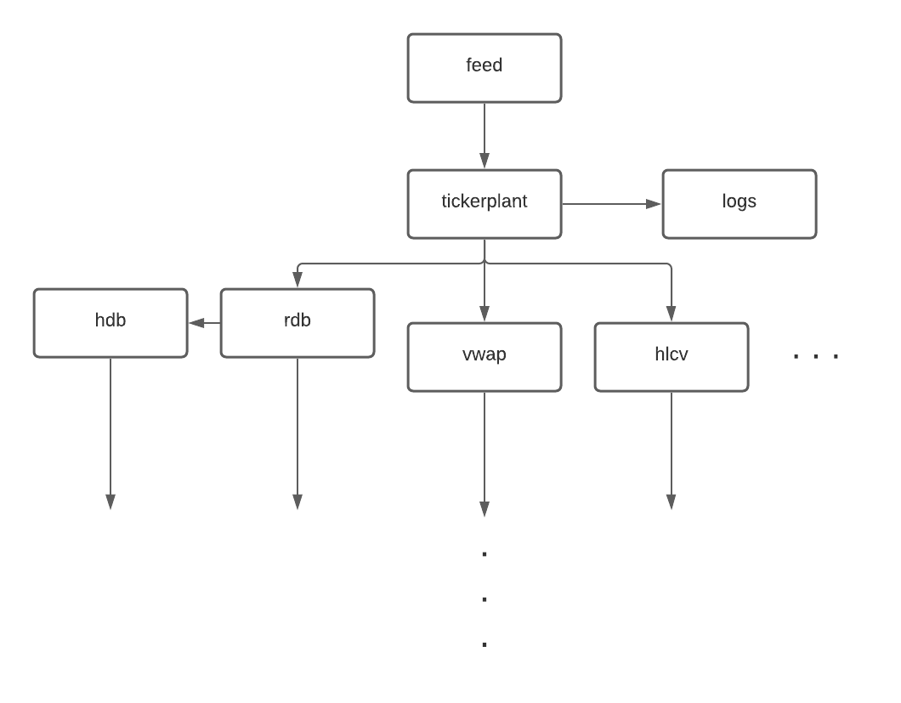

# Tickerplant
This directory contains a highly-simplified mock real-time tickerplant and data processing system created for my 
personal study.

## Installation & Start Up
On a Macbook Pro running Big Sur 11.5.2:
- Install q with the on-demand license in the default location `~/q`. 
  Otherwise, change `run.applescript` as necessary.
- Clone the repo into the default directory `~/q/q-by-practice`.
- Follow the cookbook requirement: Terminal > Preferences > New tabs open with > set to default.
- Run `run.applescript`.

## Architecture
Nodes are structured in a directed acyclic graph.
At the root of our system there is a tickerplant that receives a feed of trades and quotes. The tickerplant publishes 
this information to a series of other nodes that generate signals and aggregate the data to be published again.

The leaf nodes of the system are clients that take the refined data and provide it to external end-users. For example, 
an algorithmic trading bot could use the real-time signals to make buy/sell decisions.

*Tickerplant architecture*

Nodes communicate via IPC utilities defined in the `internal` folder including:

1. `ipc.q` specifying request handlers
2. `ps.q` providing pub/sub capabilities
3. `cb.q` implementing callbacks
4. `qy.q` exposing arbitrary functional form queries on specific tables

## Primary Nodes
### Feed
The feed consists of randomly generated data for the `trade` and `quote` tables. 
The feed prompts the tickerplant to subscribe before beginning to publish.

### Tickerplant
The tickerplant subscribes to the feed and organizes the data into a tabular format. It then publishes each table 
individually, and optionally logs the incoming feed.

### rdb
The rdb stores the current day's data in-memory.
It is responsible for writing the day's data into the hdb at the end of the day.

### hdb
The hdb stores data from previous days partitioned on date.
Both the rdb and hdb expose arbitrary functional form queries via callbacks.
These queries are limited to `select` or `exec`, as tickerplant data is meant to be read-only.

## Secondary Nodes
The primary nodes serve to format and expose the feed's real-time data.
Secondary nodes can then process this data and:

1. Publish further aggregated/refined values
2. Generate signals
3. Pipe data to end-users

For now, this project only includes the original Kx clients in `nodes/cx.q` including vwap, hlcv, and a few other
basic examples.

## TODO: Trading Strategies
An interesting endeavour could be to implement basic trading strategies within this tickerplant system.
A preliminary objective would be to establish a method to extract moving averages instead of just the naive daily vwap
client that currently exists.

Examples may include:

1. Moving average convergence divergence (MACD)
2. Pairs trading
3. Momentum-based strategies

## Resources
The code originates from the Kx open-source example:
- https://code.kx.com/q/learn/startingkdb/tick/
- https://github.com/KxSystems/kdb-tick
- https://github.com/KxSystems/cookbook/tree/master/start/tick

The majority of the original code has been refactored, simplified, or removed. 
